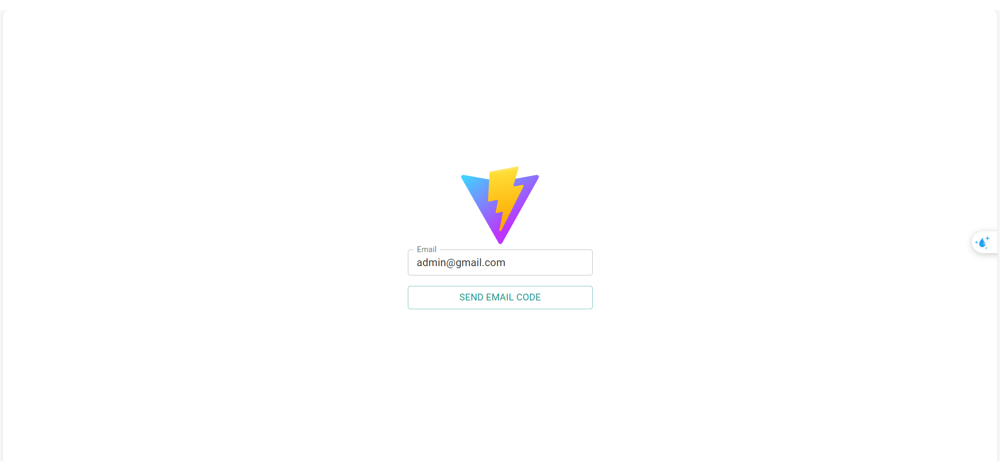
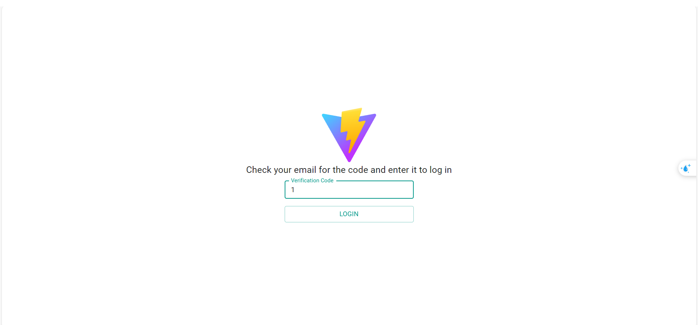
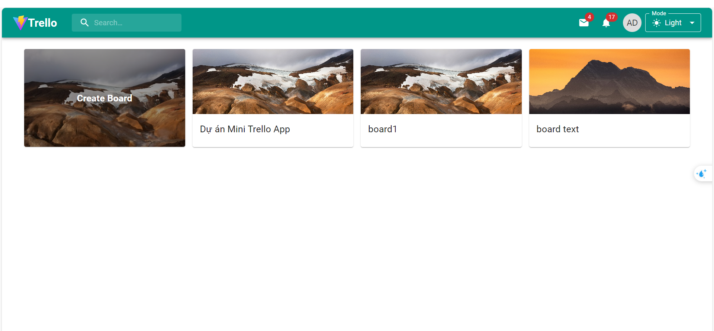
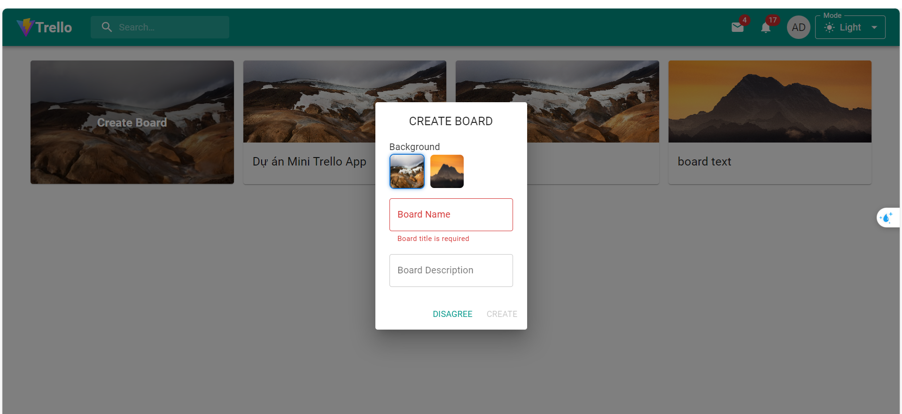
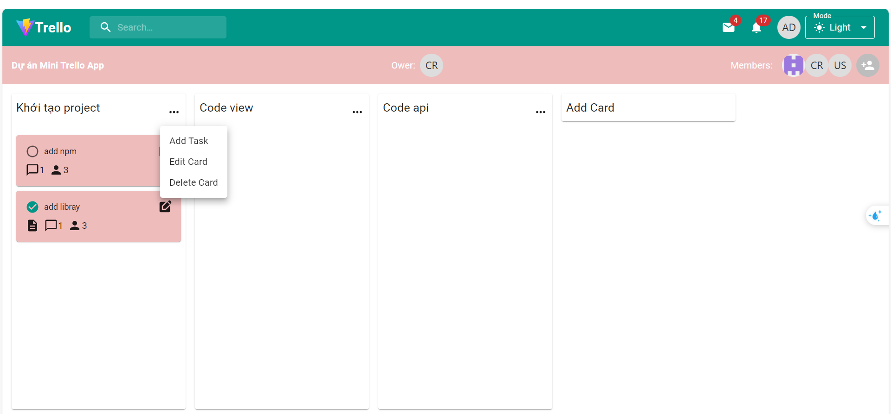
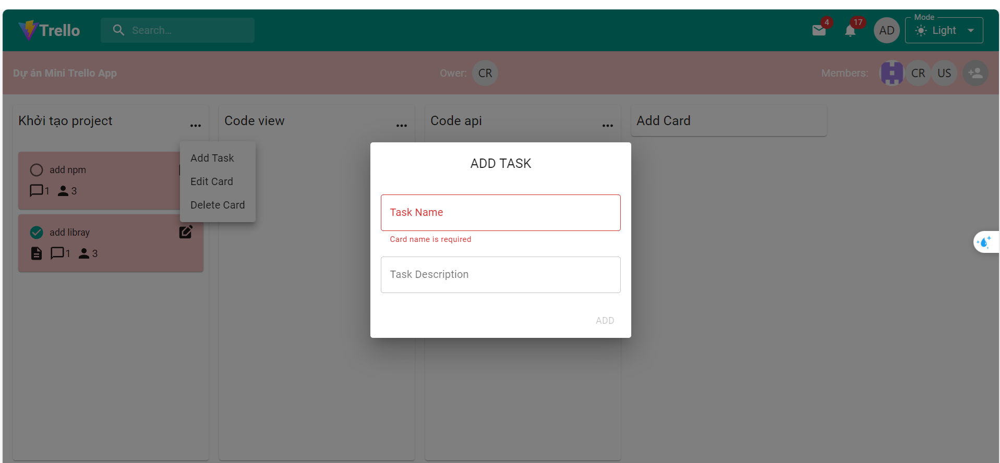
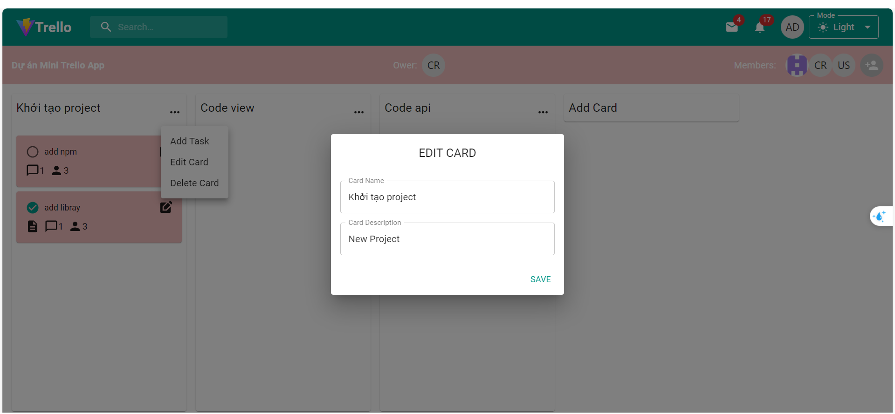
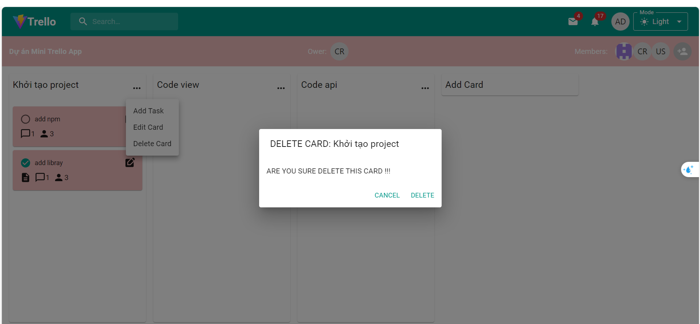
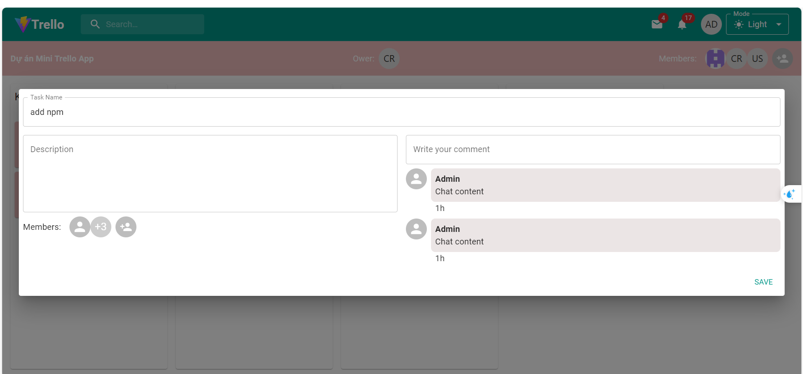

# Mini-Trello-App
Clone code: git clone https://github.com/Crashsua147/Mini-Trello-App.git
User vs code open project:
  - Run: npm install express
  - Open 2 terminal
  - Terminal 1: node server.js, Terminal 2: yarn dev
Features:
  - In HomePage you can Create Board: Enter name (required), description.
  - In BoardPage you can Create Card, Edit Card, Delete Card, Add Members in your board, Add Task, Check to update status Task 

Note Authentication: 
  - Login app with gmail: Code will send in your gmail enter code to login.
  - Login app with github: Open github.com and login.
  - Demom account with gmail:
      + Gmail: admin@gmail.com | Code: 1
      + Gmail: user@gmail.com  | Code: 2
## Ảnh màn hình ứng dụng

